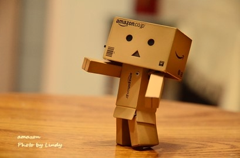
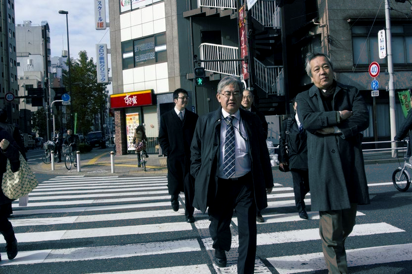

# HW1
## Overview
* 運用可調整程式，實現Q1暖色系濾鏡
* 運用可調整程式，實現Q3電影感色調

## Implementation
* For Q1 :<br>
先運用opencv函式庫讀取圖檔，並把資料存進一個矩陣Mat的資料型態，接著宣告一個uchar的指標指向Mat裡的資料進行調整。為了方便，設定變數來更改每個資料的值。其中每個指向的目標，又包含三種不同資料，故宣告三個變數以利調整。以下是部分的C++程式:
```
  float a,b,c,val;
	for (int i = 0; i<image.rows; i++){
			pixptr = image.ptr<uchar>(i);
			for (int j = 0; j<image.cols; j++){
			//調整藍色
				val = pixptr[0] * a;
				if (val > 255){ pixptr[0] = 255; }
				else{ pixptr[0] = pixptr[0] * a; }
			//調整綠色	
				val = pixptr[1] * b;
				if (val > 255){ pixptr[1] = 255; }
				else{ pixptr[1] = pixptr[1] * b; }
                //調整紅色
				val = pixptr[2] * c;
				if (val > 255){ pixptr[2] = 255; }
				else{ pixptr[2] = pixptr[2] * c; }
				pixptr += 3;
			}
		}
```
* pixptr[i],i=0~2分別代表藍綠紅，選定調整的圖是HW01.ppt裡的Robot.png。為了實現暖色調，我嘗試調高紅色的倍數，即c值，但是原圖本身圖像紅色比例很高。在機器人手臂的部分，紅色超過255，最後會只顯示綠色，所以加上限制條件，如果紅色大於255，就讓值等於255。pixptr[i]本身是uchar型別，所以當輸入的值超過255，輸出就不會有任何東西，故需要一個float型別的變數val，幫我判斷是否輸入的值會超過255。<br>
* 測試的方式是，從B10G10R105開始，BGR分別代表藍綠紅，其後接的數字第一個位數皆是個位數，第二個或三或四都是小位數。因為想讓整體畫面偏黃色，所以只進行調整B的程序而G不改變一直為1.0，所以分類有B08、B09、B10三個資料夾，最後把覺得最接近暖色調的結果貼在下方Display。

* For Q2 :<br>
  讀檔方面和Q1一樣，也會調整顏色但是會加上限制條件。另外為了接近電影感，需要調整對比度和亮度。對比度方面，根據參考資料，使用NewRGB = 128 + (RGB - 128)*(1 + Contrast)的一次方程式來進行調整。亮度方面，則是讓RGB每個資料加上一個固定的值brightness。以下為部分C++程式
```
for (int i = 0; i<image.rows; i++){
		pixptr = image.ptr<uchar>(i);
		for (int j = 0; j<image.cols; j++){
		        //取平均亮度
			avg = (pixptr[0] + pixptr[1] + pixptr[2]) / 3;
			//調整像素顏色
			if (avg < 100){
				val = pixptr[0] * a;
				if (val > 255){ pixptr[0] = 255; }
				else{ pixptr[0] = pixptr[0] * a; }

				val = pixptr[1] * b;
				if (val > 255){ pixptr[1] = 255; }
				else{ pixptr[1] = pixptr[1] * b; }

				val = pixptr[2] * c;
				if (val > 255){ pixptr[2] = 255; }
				else{ pixptr[2] = pixptr[2] * c; }
			}
			//增加或減少亮度
			for (int k = 0; k<3; k++){
			    val = pixptr[k];
			    if (val+br > 255) { pixptr[k] = 255; }
			    else if (val+br < 0) { pixptr[k] = 0; }
			    else { pixptr[k] = pixptr[k] + br; }
			}
			//對比度調整
			for (int k = 0; k < 3; k++){
			    val = pixptr[k];
			    val = 128 + (val - 128)*(1 + ct);
			    if (val>255) {pixptr[k] = 255;}
			    else if (val < 0) { pixptr[k] = 0; }
			    else { pixptr[k] = 128 + (pixptr[k] - 128)*(1 + ct); }
			}
			pixptr += 3;
		}
	}
```
* 顏色調整方面，只調整陰影處的顏色，依個人主觀取平均亮度為100以下的是陰影，讓紅色減弱，藍色和綠色加強，其餘程式如同Q1。<br>

* 對比度和亮度方面，分別都會對像素裡每個顏色進行調整，亮度每5單位調整一次，正負分別代表加強和減弱，而對比度則是每0.1單位調整，正負同理，但是為了加強電影感，所以對比度皆是正值。如同Q1，我會需要一個float變數val幫我通過if的條件式。關於對比度公式，其中的128是方便而訂。嘗試了很多數據，最後是選擇使用B11G105R08、br=-5和ct=0.1，結果貼在Display。

## Theory
* 圖片可以切分成很多很多個pixel像素，每個像素都包含藍綠紅三種顏色，剛好分別代表程式中，pixptr[0]、pixptr[1]、pixptr[2]，而其中的值等於顏色的亮度，個人覺得也可以想成是"濃度"。圖像輸入程式轉換的資料型態是uchar，只能表示出0~255值，超過255或低於0會沒辦法顯示，所以要加上限制條件。不然會有某一個顏色，沒有顯示出來的後果，就像Q1提到，Robot.jpg中調強紅色時，機器人的手臂會只顯示綠色。另外若三種顏色都是0會顯示黑色，255會顯示白色。<br>

* 要實現暖色系，主要提高紅色，而綠色和藍色可以酌量調整。反之，冷色系主要調整藍色。<br>

* 對比公式的解釋 NewRGB = 128 + (RGB - 128)*(1 + Contrast) :
RGB是指R、G或B分別的亮度，New經過對比後的結果。公式中128只是因為方便，取0~255的中間值，實際上是整張圖的平均亮度。Contrast是對比度，通常值介於-1~1之間，取Contrast=0.5、RGB=156和100為例，156跟100和128的差值取絕對值都是28，呈上1.5斜率，對應到新的值是170和86，讓新的值之間的差距和舊的值之間差距變大，達到明亮處和陰暗處反差變大的效果<br>

## Disparity result
* Q1 Result<br>

* Q3 Result<br>


## Reference
1.http://www.2cto.com/kf/201311/256934.html<br>
2.http://photoblog.hk/wordpress/105136/%E5%A6%82%E4%BD%95%E5%9C%A8-ps-%E4%BB%A5%E6%9B%B2%E7%B7%9A-curves-%E6%8B%89%E5%87%BA%E9%9B%BB%E5%BD%B1%E6%84%9F%E8%89%B2%E8%AA%BF


